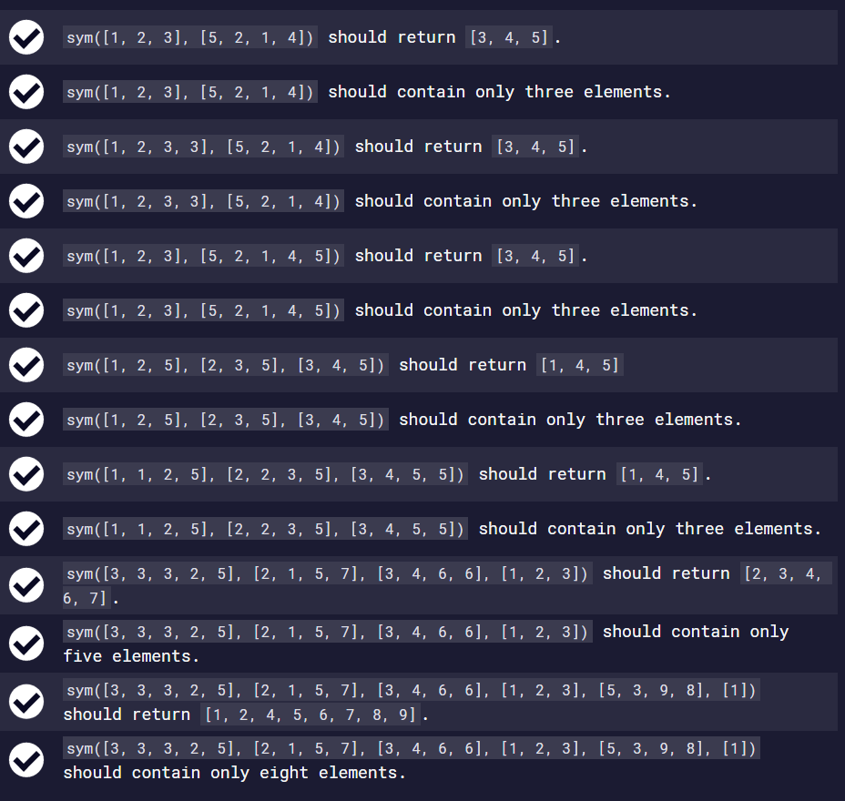

# This is my coding challenge diary

## As a coder it can be easy to fall into the same old tricks but having a daily practice can make you more flexible and smarter.  If you can code everyday you are bound to become a master. Follow the daily challenges I am trying each day here. Feel free to copy this README and do them with me. 
## I will be tracking my coding challenge solutions here day by day. Obiviously there are many ways to solve these challenges, so don't just accept my solutions as the best solution. If you have better solution I'd love to know. 
## My email is howardjake9512@gmail.com
(https://www.freecodecamp.org/ is my main source but I may branch out if need be) 


# Day 1 (FreeCodeCamp)

// 100 doors

There are 100 doors in a row that are all initially closed. You make 100 passes by the doors. The first time through, visit every door and 'toggle' the door (if the door is closed, open it; if it is open, close it). The second time, only visit every 2nd door (i.e., door #2, #4, #6, ...) and toggle it. The third time, visit every 3rd door (i.e., door #3, #6, #9, ...), etc., until you only visit the 100th door.

Implement a function to determine the state of the doors after the last pass. Return the final result in an array, with only the door number included in the array if it is open.

Expected ouput at 100 doors.
```
[ 1, 4, 9, 16, 25, 36, 49, 64, 81, 100 ]
```
Language I used: (Javascript)
# Day 2 (FreeCodeCamp)

// Find the Symmetric Difference

The mathematical term symmetric difference (△ or ⊕) of two sets is the set of elements which are in either of the two sets but not in both. For example, for sets A = {1, 2, 3} and B = {2, 3, 4}, A △ B = {1, 4}.

Symmetric difference is a binary operation, which means it operates on only two elements. So to evaluate an expression involving symmetric differences among three elements (A △ B △ C), you must complete one operation at a time. Thus, for sets A and B above, and C = {2, 3}, A △ B △ C = (A △ B) △ C = {1, 4} △ {2, 3} = {1, 2, 3, 4}.

Create a function that takes two or more arrays and returns an array of their symmetric difference. The returned array must contain only unique values (no duplicates).



Language I used: (Javascript)
# Day 3 (Codewars)

// Sum of Digits / Digital Root 

Digital root is the recursive sum of all the digits in a number.

Given n, take the sum of the digits of n. If that value has more than one digit, continue reducing in this way until a single-digit number is produced. The input will be a non-negative integer.


Example:
```
    16  -->  1 + 6 = 7
   942  -->  9 + 4 + 2 = 15  -->  1 + 5 = 6
132189  -->  1 + 3 + 2 + 1 + 8 + 9 = 24  -->  2 + 4 = 6
493193  -->  4 + 9 + 3 + 1 + 9 + 3 = 29  -->  2 + 9 = 11  -->  1 + 1 = 2
```

Language I used: (Javascript)
# Day 4 (FreeCodeCamp)

// Pairwise

Given an array arr, find element pairs whose sum equal the second argument arg and return the sum of their indices.

You may use multiple pairs that have the same numeric elements but different indices. Each pair should use the lowest possible available indices. Once an element has been used it cannot be reused to pair with another element. For instance, pairwise([1, 1, 2], 3) creates a pair [2, 1] using the 1 at index 0 rather than the 1 at index 1, because 0+2 < 1+2.

For example pairwise([7, 9, 11, 13, 15], 20) returns 6. The pairs that sum to 20 are [7, 13] and [9, 11]. We can then write out the array with their indices and values.

### Index	0	1	2	3	4
### Value	7	9	11	13	15
### Below we'll take their corresponding indices and add them.
Expected output
### 7 + 13 = 20 → Indices 0 + 3 = 3
### 9 + 11 = 20 → Indices 1 + 2 = 3
### 3 + 3 = 6 → Return 6
### pairwise([1, 4, 2, 3, 0, 5], 7) should return 11.
### pairwise([1, 3, 2, 4], 4) should return 1.
### pairwise([1, 1, 1], 2) should return 1.
### pairwise([0, 0, 0, 0, 1, 1], 1) should return 10.
### pairwise([], 100) should return 0.

Language I used: (Javascript)

# Day 5 (FreeCodeCamp / Algorithms)

// Implement Bubble SortPassed

This is the first of several challenges on sorting algorithms. Given an array of unsorted items, we want to be able to return a sorted array. We will see several different methods to do this and learn some tradeoffs between these different approaches. While most modern languages have built-in sorting methods for operations like this, it is still important to understand some of the common basic approaches and learn how they can be implemented.

 Here we will see bubble sort. The bubble sort method starts at the beginning of an unsorted array and 'bubbles up' unsorted values towards the end, iterating through the array until it is completely sorted. It does this by comparing adjacent items and swapping them if they are out of order. The method continues looping through the array until no swaps occur at which point the array is sorted.

This method requires multiple iterations through the array and for average and worst cases has quadratic time complexity. While simple, it is usually impractical in most situations.

Instructions: Write a function bubbleSort which takes an array of integers as input and returns an array of these integers in sorted order from least to greatest.

### Starter Code
```
function bubbleSort(array) {
  // Only change code below this line
  return array;
  // Only change code above this line
}

bubbleSort([1, 4, 2, 8, 345, 123, 43, 32, 5643, 63, 123, 43, 2, 55, 1, 234, 92]);
```
Language I used: (Javascript)
### Expected Output
```

[ 1, 1, 2, 2, 4, 8, 32, 43, 43, 55, 63, 92, 123, 123, 234, 345, 5643 ]
```
# Day 6 (CodeWars via [jacobb](https://www.codewars.com/kata/5390bac347d09b7da40006f6/train/javascript))
// Jaden Casing Strings


Jaden Smith, the son of Will Smith, is the star of films such as The Karate Kid (2010) and After Earth (2013). Jaden is also known for some of his philosophy that he delivers via Twitter. When writing on Twitter, he is known for almost always capitalizing every word. For simplicity, you'll have to capitalize each word, check out how contractions are expected to be in the example below.

Your task is to convert strings to how they would be written by Jaden Smith. The strings are actual quotes from Jaden Smith, but they are not capitalized in the same way he originally typed them.

[Link to Jaden's former Twitter account @officialjaden via archive.org](https://web.archive.org/web/20190624190255/https://twitter.com/officialjaden)

### Example:
```
Not Jaden-Cased: "How can mirrors be real if our eyes aren't real"
Jaden-Cased:     "How Can Mirrors Be Real If Our Eyes Aren't Real"
```
Language I used: (Javascript)

# Day 7 (CodeWars via [kwy95](https://www.codewars.com/kata/544aed4c4a30184e960010f4/train/javascript))

// Find the divisors!

Create a function named divisors/Divisors that takes an integer n > 1 and returns an array with all of the integer's divisors(except for 1 and the number itself), from smallest to largest. If the number is prime return the string '(integer) is prime' (null in C#) (use Either String a in Haskell and Result<Vec<u32>, String> in Rust).

Example:
```
divisors(12); // should return [2,3,4,6]
divisors(25); // should return [5]
divisors(13); // should return "13 is prime"
```

Language I used: (Javascript)

# Day 8 (FreeCodeCamp / Algorithms)

// Implement Selection Sort

Here we will implement selection sort. Selection sort works by selecting the minimum value in a list and swapping it with the first value in the list. It then starts at the second position, selects the smallest value in the remaining list, and swaps it with the second element. It continues iterating through the list and swapping elements until it reaches the end of the list. Now the list is sorted. Selection sort has quadratic time complexity in all cases.

Instructions: Write a function selectionSort which takes an array of integers as input and returns an array of these integers in sorted order from least to greatest.
```
selectionSort([1, 4, 2, 8, 345, 123, 43, 32, 5643, 63, 123, 43, 2, 55, 1, 234, 92])

Should come out to 
-> [ 1, 1, 2, 2, 4, 8, 32, 43, 43, 55, 63, 92, 123, 123, 234, 345, 5643 ]

```
Language I used: (Javascript)

# Day 9 (FreeCodeCamp / Algorithms)

// Implement Quick Sort

Here we will move on to an intermediate sorting algorithm: quick sort. Quick sort is an efficient, recursive divide-and-conquer approach to sorting an array. In this method, a pivot value is chosen in the original array. The array is then partitioned into two subarrays of values less than and greater than the pivot value. We then combine the result of recursively calling the quick sort algorithm on both sub-arrays. This continues until the base case of an empty or single-item array is reached, which we return. The unwinding of the recursive calls return us the sorted array.

Quick sort is a very efficient sorting method, providing O(nlog(n)) performance on average. It is also relatively easy to implement. These attributes make it a popular and useful sorting method.

Instructions: Write a function quickSort which takes an array of integers as input and returns an array of these integers in sorted order from least to greatest. While the choice of the pivot value is important, any pivot will do for our purposes here. For simplicity, the first or last element could be used.

```
QuickSort([1, 4, 2, 8, 345, 123, 43, 32, 5643, 63, 123, 43, 2, 55, 1, 234, 92])

Should come out to 
-> [ 1, 1, 2, 2, 4, 8, 32, 43, 43, 55, 63, 92, 123, 123, 234, 345, 5643 ]

```
Language I used: (Javascript)

# Day 10 (CodeWars via [xDranik](https://www.codewars.com/kata/525f50e3b73515a6db000b83/train/ruby))

// Create Phone Number

Write a function that accepts an array of 10 integers (between 0 and 9), that returns a string of those numbers in the form of a phone number.
```
Example:
createPhoneNumber([1, 2, 3, 4, 5, 6, 7, 8, 9, 0]) # => returns "(123) 456-7890"
```
Language I used: (Ruby)

# Day 11 (CodeWars via [Aweson1](https://www.codewars.com/kata/55b42574ff091733d900002f/train/python))

// Friend or Foe?

Make a program that filters a list of strings and returns a list with only your friends name in it.

If a name has exactly 4 letters in it, you can be sure that it has to be a friend of yours! Otherwise, you can be sure he's not...

Ex: Input = ["Ryan", "Kieran", "Jason", "Yous"], Output = ["Ryan", "Yous"]

i.e.
``` 
friend ["Ryan", "Kieran", "Mark"] `shouldBe` ["Ryan", "Mark"]
``` 
Note: keep the original order of the names in the output.

Language I used: (Python)

# Day 12 (CodeWars via [g964](https://www.codewars.com/kata/5656b6906de340bd1b0000ac/train/python))

// Two to One

Take 2 strings s1 and s2 including only letters from ato z. Return a new sorted string, the longest possible, containing distinct letters - each taken only once - coming from s1 or s2.

Examples:
```
a = "xyaabbbccccdefww"
b = "xxxxyyyyabklmopq"
longest(a, b) -> "abcdefklmopqwxy"

a = "abcdefghijklmnopqrstuvwxyz"
longest(a, a) -> "abcdefghijklmnopqrstuvwxyz"
```

Language I used: (Python)